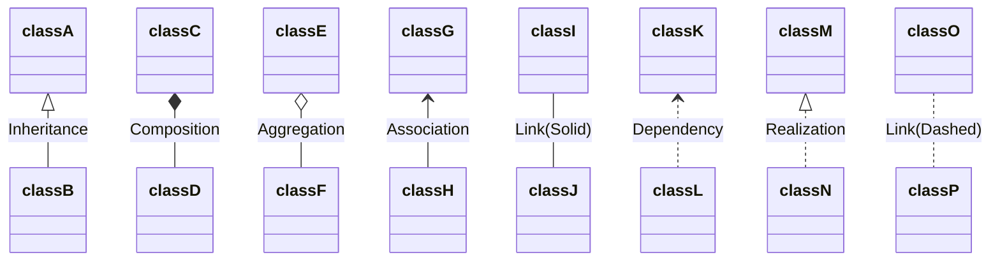
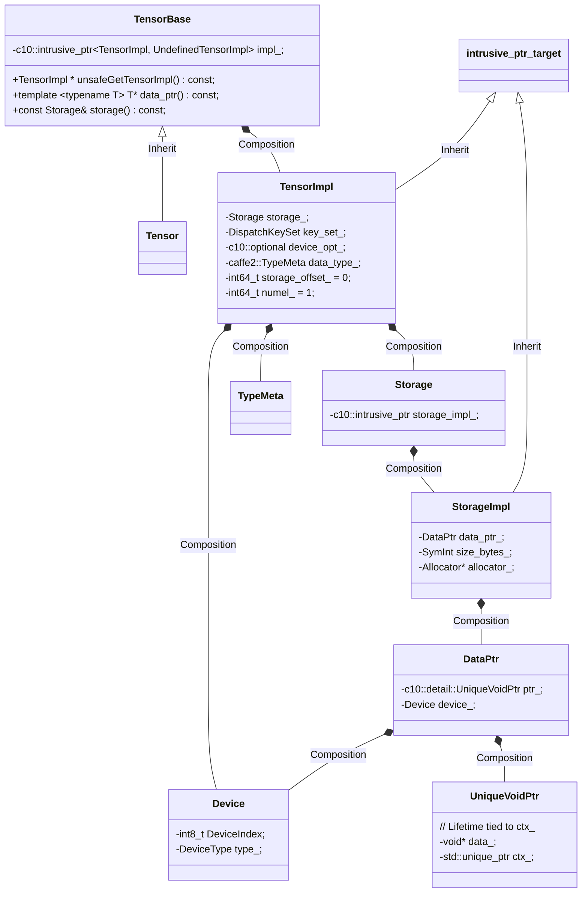

# Torch Tensor

UML ref




## Header files

`Tensor` is declared in `TensorBody.h` instead of `Tensor.h`, 

- aten/src/ATen/Tensor.h

```c++
#pragma once

#include <ATen/core/Tensor.h>
```

- aten/src/ATen/core/Tensor.h

```c++
#pragma once

#include <ATen/core/TensorBody.h>
```

- aten/src/ATen/templates/TensorBody.h

```c++
#include <c10/core/TensorImpl.h>
#include <c10/util/intrusive_ptr.h>
#include <ATen/core/NamedTensor.h>
#include <ATen/core/TensorBase.h>
```

- aten/src/ATen/core/TensorBase.h

```
#include <c10/core/TensorImpl.h>
#include <c10/util/intrusive_ptr.h>
#include <ATen/core/NamedTensor.h>
```


class `TensorBase` is declared in `aten/src/ATen/core/TensorBase.h` and implemented in `aten/src/ATen/core/Tensor.cpp`

class `Tensor` is declared and implemented in `aten/src/ATen/templates/TensorBody.h` (`register_hook` implemented in `aten/src/ATen/core/Tensor.h`, and `data_ptr` related template functions are implemented in `aten/src/ATen/templates/TensorMethods.cpp`)


## Tensor Structure





### TensorBase and Tensor

```c++
// NOTE: [Tensor vs. TensorBase]
//
// Tensor, being the central data structure in PyTorch, gets used and
// it's header included almost everywhere. Unfortunately this means
// every time an operator signature is updated or changed in
// native_functions.yaml, you (and every other PyTorch developer) need
// to recompile all of ATen and it's dependencies.
//
// TensorBase aims to break up these header dependencies, and improve
// incremental build times for all PyTorch developers. TensorBase
// represents a reference counted handle to TensorImpl, exactly the
// same as Tensor. However, TensorBase doesn't have code generated
// methods in it's API and thus no dependence on native_functions.yaml.
```

`TensorBase` constructors:

```c++
class  TensorBase {
 protected:
  // Create a Tensor with a +0 reference count. Special care must be
  // taken to avoid decrementing this reference count at destruction
  // time. Intended to support MaybeOwnedTraits<Tensor>.
  explicit TensorBase(unsafe_borrow_t, const TensorBase& rhs)
      : impl_(c10::intrusive_ptr<at::TensorImpl, UndefinedTensorImpl>::reclaim(rhs.impl_.get())) {}

 public:
  TensorBase() = default;
  // This constructor should not be used by end users and is an implementation
  // detail invoked by autogenerated code.
  explicit TensorBase(
      c10::intrusive_ptr<TensorImpl, UndefinedTensorImpl> tensor_impl)
      : impl_(std::move(tensor_impl)) {
    if (impl_.get() == nullptr) {
      throw std::runtime_error("TensorImpl with nullptr is not supported");
    }
  }
  TensorBase(const TensorBase&) = default;
  TensorBase(TensorBase&&) noexcept = default;
  TensorBase& operator=(const TensorBase& x) & = default;
  TensorBase& operator=(TensorBase&& x) & noexcept = default;

  // Ban assignment to rvalues, since at::Tensor (weirdly) performs a deep copy here
  TensorBase& operator=(const TensorBase&) && = delete;
  TensorBase& operator=(TensorBase&&) && noexcept = delete;

};
```


### Intrusive_ptr


### TensorImpl

Constructor for TensorImpl

```c++
struct C10_API TensorImpl : public c10::intrusive_ptr_target {
  TensorImpl() = delete;
  ~TensorImpl() override;
  // Note [Enum ImplType]
  // This enum is temporary. In the followup refactor we should
  // think about how to specialize TensorImpl creation for view
  // tensors. Currently we only special case its key_set_ but
  // there's also potential to share version_counter_ directly
  // without creating first and then override in as_view.
  enum ImplType { VIEW };

  /**
   * Construct a 1-dim 0-size tensor backed by the given storage.
   */
  TensorImpl(
      Storage&& storage,
      DispatchKeySet,
      const caffe2::TypeMeta data_type);

  // See Note [Enum ImplType]
  TensorImpl(
      ImplType,
      Storage&& storage,
      DispatchKeySet,
      const caffe2::TypeMeta data_type);

  /**
   * Construct a 1-dim 0 size tensor that doesn't have a storage.
   */
  TensorImpl(
      DispatchKeySet,
      const caffe2::TypeMeta data_type,
      c10::optional<c10::Device> device_opt);

  // Legacy constructors so I don't have to go update call sites.
  // TODO: When Variable is added, delete these constructors
  TensorImpl(
      Storage&& storage,
      DispatchKey dispatch_key,
      const caffe2::TypeMeta data_type)
      : TensorImpl(
            std::move(storage),
            DispatchKeySet(dispatch_key),
            data_type) {}
  TensorImpl(
      DispatchKey dispatch_key,
      const caffe2::TypeMeta data_type,
      c10::optional<c10::Device> device_opt)
      : TensorImpl(DispatchKeySet(dispatch_key), data_type, device_opt) {}

 private:
  // This constructor is private, because the data_type is redundant with
  // storage.  Still, we pass it in separately because it's easier to write
  // the initializer list if we're not worried about storage being moved out
  // from under us.
  TensorImpl(
      Storage&& storage,
      DispatchKeySet,
      const caffe2::TypeMeta data_type,
      c10::optional<c10::Device>);

 public:
  TensorImpl(const TensorImpl&) = delete;
  TensorImpl& operator=(const TensorImpl&) = delete;
  TensorImpl(TensorImpl&&) = delete;
  TensorImpl& operator=(TensorImpl&&) = delete;
};
```

The important member variables:

- `Storage storage_` stores the actual data
- `TypeMeta data_type_` used for the metadata of tensor type
- `c10::optional<c10::Device> device_opt_` indicate the device information and `nullopt` for undefined tensor.

### Allocator

Allocator is registered by macro `REGISTER_ALLOCATOR`,  which finally set the allocator into a global variable `allocator_array`, with the `DeviceType` cast to index.

```c++
template <DeviceType t>
struct AllocatorRegisterer {
  explicit AllocatorRegisterer(Allocator* alloc) {
    SetAllocator(t, alloc);
  }
};

#define REGISTER_ALLOCATOR(t, f)                       \
  namespace {                                          \
  static c10::AllocatorRegisterer<t> g_allocator_d(f); \
  }

void SetAllocator(at::DeviceType t, at::Allocator* alloc, uint8_t priority) {
  if (priority >= allocator_priority[static_cast<int>(t)]) {
    allocator_array[static_cast<int>(t)] = alloc;
    allocator_priority[static_cast<int>(t)] = priority;
  }
}
```


### TypeMeta


`TypeMeta` is to record the meta information for given type including: the size of T, the new/delete/copy/... operators of T, etc. It's just a wrapper for `TypeMetaData` which is a pure struct for the meta data of a type:

```c++
struct TypeMetaData final {
  using New = void*();
  using PlacementNew = void(void*, size_t);
  using Copy = void(const void*, void*, size_t);
  using PlacementDelete = void(void*, size_t);
  using Delete = void(void*);

  constexpr TypeMetaData() noexcept
      : itemsize_(0),
        new_(nullptr),
        placementNew_(nullptr),
        copy_(nullptr),
        placementDelete_(nullptr),
        delete_(nullptr),
        id_(TypeIdentifier::uninitialized()),
        name_("nullptr (uninitialized)") {}

  constexpr TypeMetaData(
      size_t itemsize,
      New* newFn,
      PlacementNew* placementNew,
      Copy* copy,
      PlacementDelete* placementDelete,
      Delete* deleteFn,
      TypeIdentifier id,
      c10::string_view name) noexcept
      : itemsize_(itemsize),
        new_(newFn),
        placementNew_(placementNew),
        copy_(copy),
        placementDelete_(placementDelete),
        delete_(deleteFn),
        id_(id),
        name_(name) {}

  size_t itemsize_;
  New* new_;
  PlacementNew* placementNew_;
  Copy* copy_;
  PlacementDelete* placementDelete_;
  Delete* delete_;
  TypeIdentifier id_;
  c10::string_view name_;
};
```

`TypeMeta` uses a `index_` to point to the actual `TypeMetaData`, and the constructor ` TypeMeta(const uint16_t index)` is declared as `private` . User should use `TypeMeta::Make<T>` to create a `TypeMeta`.

```c++
class C10_API TypeMeta final {
 public:
  using New = detail::TypeMetaData::New;
  using PlacementNew = detail::TypeMetaData::PlacementNew;
  using Copy = detail::TypeMetaData::Copy;
  using PlacementDelete = detail::TypeMetaData::PlacementDelete;
  using Delete = detail::TypeMetaData::Delete;

  /** Create a dummy TypeMeta object. To create a TypeMeta object for a specific
   * type, use TypeMeta::Make<T>().
   */
  TypeMeta() noexcept;

  /**
   * Copy constructor.
   */
  TypeMeta(const TypeMeta& src) noexcept = default;

  /**
   * Assignment operators.
   */
  TypeMeta& operator=(const TypeMeta& src) noexcept = default;

  TypeMeta(TypeMeta&& rhs) noexcept = default;

  inline TypeMeta& operator=(ScalarType scalar_type) noexcept {
    index_ = static_cast<uint16_t>(scalar_type);
    return *this;
  }

 private:
  // TypeMeta can only be created by Make, making sure that we do not
  // create incorrectly mixed up TypeMeta objects.
  explicit TypeMeta(const uint16_t index) noexcept : index_(index) {}
  static detail::TypeMetaData* typeMetaDatas(); // create all TypeMetaData
  inline const detail::TypeMetaData& data() const {
    return typeMetaDatas()[index_]; // fetch expected TypeMetaData with given index_
  }
};
```

The `Make<T>` function calls the private constructor in `TypeMeta`, and `index_` is provided by `_typeMetaData<T>()` which calculate the index with given type `T`:

```c++
  template <typename T>
  static TypeMeta Make() {
    // The instance pointed to is declared here, but defined in a .cpp file.
    // We need to silence the compiler warning about using an undefined
    // variable template. '-Wpragmas' and '-Wunknown-warning-option' has to be
    // disabled for compilers that don't know '-Wundefined-var-template' and
    // would error at our attempt to disable it.
#ifndef _MSC_VER
#pragma GCC diagnostic push
#pragma GCC diagnostic ignored "-Wpragmas"
#pragma GCC diagnostic ignored "-Wunknown-warning-option"
#pragma GCC diagnostic ignored "-Wundefined-var-template"
#endif
    return TypeMeta(_typeMetaData<T>());
#ifndef _MSC_VER
#pragma GCC diagnostic pop
#endif
  }
  template <class T>
  C10_API static uint16_t _typeMetaData() noexcept;

#define DEFINE_SCALAR_METADATA_INSTANCE(T, name)             \
  template <>                                                \
  constexpr uint16_t TypeMeta::_typeMetaData<T>() noexcept { \
    return static_cast<uint16_t>(ScalarType::name);          \
  }
AT_FORALL_SCALAR_TYPES_WITH_COMPLEX_AND_QINTS(DEFINE_SCALAR_METADATA_INSTANCE)
#undef DEFINE_SCALAR_METADATA_INSTANCE

template <>
C10_EXPORT constexpr uint16_t TypeMeta::_typeMetaData<
    detail::_Uninitialized>() noexcept {
  return static_cast<uint16_t>(ScalarType::Undefined);
}
```

When `index_` is created in `TypeMeta`, it is used in `TypeMeta::data()` to fetch the actual `TypeMetaData` from an array. This `TypeMetaData` array is created by a local static variable in `TypeMeta::typeMetaDatas`

```c++
detail::TypeMetaData* TypeMeta::typeMetaDatas() {
  // NOLINTNEXTLINE(cppcoreguidelines-avoid-c-arrays,modernize-avoid-c-arrays)
  static detail::TypeMetaData instances[MaxTypeIndex + 1] = {
#define SCALAR_TYPE_META(T, name)        \
  /* ScalarType::name */                 \
  detail::TypeMetaData(                  \
      sizeof(T),                         \
      detail::_PickNew<T>(),             \
      detail::_PickPlacementNew<T>(),    \
      detail::_PickCopy<T>(),            \
      detail::_PickPlacementDelete<T>(), \
      detail::_PickDelete<T>(),          \
      TypeIdentifier::Get<T>(),          \
      c10::util::get_fully_qualified_type_name<T>()),
      AT_FORALL_SCALAR_TYPES_WITH_COMPLEX_AND_QINTS(SCALAR_TYPE_META)
#undef SCALAR_TYPE_META
      // The remainder of the array is padded with TypeMetaData blanks.
      // The first of these is the entry for ScalarType::Undefined.
      // The rest are consumed by CAFFE_KNOWN_TYPE entries.
  };
  return instances;
}
```

