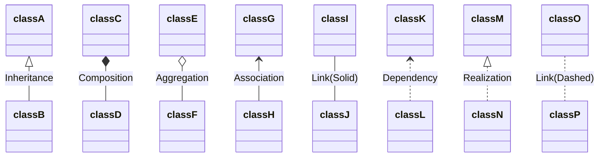
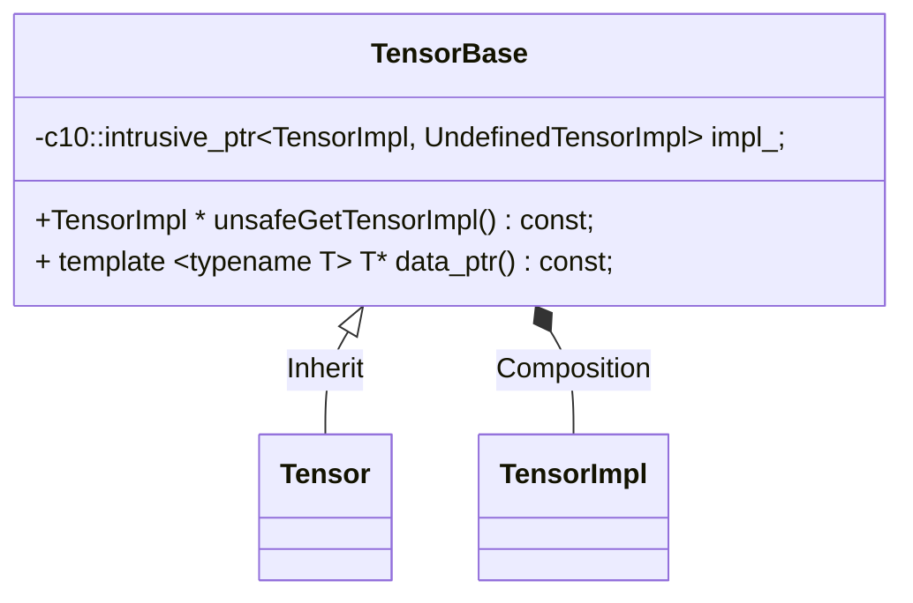

# Torch Tensor

UML ref




## Header files

`Tensor` is declared in `TensorBody.h` instead of `Tensor.h`, 

- aten/src/ATen/Tensor.h

```c++
#pragma once

#include <ATen/core/Tensor.h>
```

- aten/src/ATen/core/Tensor.h

```c++
#pragma once

#include <ATen/core/TensorBody.h>
```

- aten/src/ATen/templates/TensorBody.h

```c++
#include <c10/core/TensorImpl.h>
#include <c10/util/intrusive_ptr.h>
#include <ATen/core/NamedTensor.h>
#include <ATen/core/TensorBase.h>
```

- aten/src/ATen/core/TensorBase.h

```
#include <c10/core/TensorImpl.h>
#include <c10/util/intrusive_ptr.h>
#include <ATen/core/NamedTensor.h>
```


class `TensorBase` is declared in `aten/src/ATen/core/TensorBase.h` and implemented in `aten/src/ATen/core/Tensor.cpp`

class `Tensor` is declared and implemented in `aten/src/ATen/templates/TensorBody.h` (`register_hook` implemented in `aten/src/ATen/core/Tensor.h`, and `data_ptr` related template functions are implemented in `aten/src/ATen/templates/TensorMethods.cpp`)


## Tensor Structure





### TensorBase and Tensor

```c++
// NOTE: [Tensor vs. TensorBase]
//
// Tensor, being the central data structure in PyTorch, gets used and
// it's header included almost everywhere. Unfortunately this means
// every time an operator signature is updated or changed in
// native_functions.yaml, you (and every other PyTorch developer) need
// to recompile all of ATen and it's dependencies.
//
// TensorBase aims to break up these header dependencies, and improve
// incremental build times for all PyTorch developers. TensorBase
// represents a reference counted handle to TensorImpl, exactly the
// same as Tensor. However, TensorBase doesn't have code generated
// methods in it's API and thus no dependence on native_functions.yaml.
```

`TensorBase` constructors:

```c++
class  TensorBase {
 protected:
  // Create a Tensor with a +0 reference count. Special care must be
  // taken to avoid decrementing this reference count at destruction
  // time. Intended to support MaybeOwnedTraits<Tensor>.
  explicit TensorBase(unsafe_borrow_t, const TensorBase& rhs)
      : impl_(c10::intrusive_ptr<at::TensorImpl, UndefinedTensorImpl>::reclaim(rhs.impl_.get())) {}

 public:
  TensorBase() = default;
  // This constructor should not be used by end users and is an implementation
  // detail invoked by autogenerated code.
  explicit TensorBase(
      c10::intrusive_ptr<TensorImpl, UndefinedTensorImpl> tensor_impl)
      : impl_(std::move(tensor_impl)) {
    if (impl_.get() == nullptr) {
      throw std::runtime_error("TensorImpl with nullptr is not supported");
    }
  }
  TensorBase(const TensorBase&) = default;
  TensorBase(TensorBase&&) noexcept = default;
  TensorBase& operator=(const TensorBase& x) & = default;
  TensorBase& operator=(TensorBase&& x) & noexcept = default;

  // Ban assignment to rvalues, since at::Tensor (weirdly) performs a deep copy here
  TensorBase& operator=(const TensorBase&) && = delete;
  TensorBase& operator=(TensorBase&&) && noexcept = delete;

};
```

